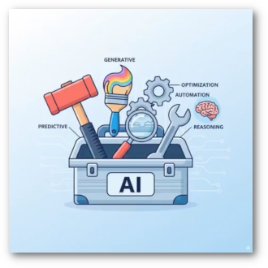
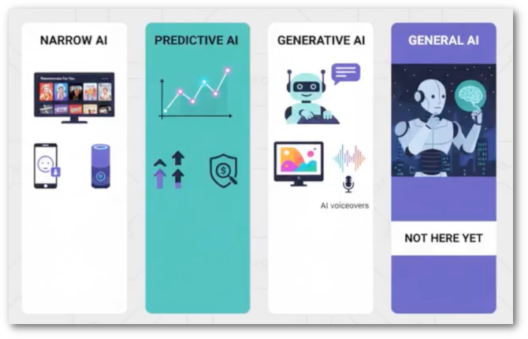

# What is AI?

<table width="100%">
<tr>
<td></td>
<td>Artificial Intelligence (AI) refers to computer systems designed to perform tasks that typically require human intelligence. These tasks include learning from experience, recognizing patterns, understanding language, making decisions, and solving complex problems. Rather than following pre-programmed rules for every scenario, AI systems can adapt and improve their performance over time based on the data they process.

At its core, AI is about creating machines that can think, learn, and act in ways that mirror human cognitive abilities. This field encompasses various approaches and technologies, from simple pattern recognition to complex neural networks that can generate creative content or make sophisticated predictions.</td>
</tr>
</table>

## Four Flavors of AI

<table>
<tr>
<td>AI comes in different forms, each with distinct capabilities and applications. Understanding these four primary categories helps us grasp both the current state and future potential of artificial intelligence. From specialized systems that excel at specific tasks to the theoretical concept of machines with human-level intelligence, these flavors represent different points along the AI spectrum.</td>
<td></td>
</tr>
</table>

### Narrow AI

Narrow AI, also known as Weak AI, is designed to perform specific tasks within a limited domain. This is the most common form of AI we encounter today. Examples include voice assistants like Siri or Alexa, recommendation algorithms on Netflix or Spotify, and spam filters in email systems.

These systems excel at their designated tasks but cannot transfer their knowledge or skills to other domains. A chess-playing AI cannot suddenly decide to play poker or diagnose medical conditions—it's highly specialized and operates within well-defined boundaries. Despite these limitations, Narrow AI has proven incredibly valuable across industries, from healthcare diagnostics to financial fraud detection.

### Predictive AI

Predictive AI analyzes historical data and patterns to forecast future outcomes or behaviors. This flavor of AI is widely used in business intelligence, risk assessment, and decision-making processes. By identifying trends and correlations in large datasets, predictive AI helps organizations anticipate customer behavior, market trends, equipment failures, and more.

Common applications include weather forecasting, stock market predictions, customer churn analysis, and predictive maintenance in manufacturing. These systems use machine learning algorithms to recognize patterns that humans might miss, enabling proactive rather than reactive decision-making. The accuracy of predictive AI depends heavily on the quality and quantity of historical data available.

### Generative AI

Generative AI represents a breakthrough in artificial intelligence, capable of creating new content including text, images, music, code, and video. Unlike traditional AI that analyzes or classifies existing data, generative AI produces original outputs based on patterns learned from training data. Tools like ChatGPT, DALL-E, and Midjourney exemplify this technology.

These systems use advanced neural networks, particularly transformers and diffusion models, to understand context and generate human-like creative content. Generative AI is revolutionizing creative industries, software development, content creation, and problem-solving. However, it also raises important questions about authenticity, copyright, and the responsible use of AI-generated content.

### General AI

General AI, also called Artificial General Intelligence (AGI) or Strong AI, refers to machines with human-level intelligence across all cognitive domains. This theoretical form of AI would possess the ability to understand, learn, and apply knowledge across any intellectual task that a human can perform. Unlike Narrow AI, AGI would demonstrate true reasoning, abstract thinking, and the ability to transfer knowledge between different domains.

Currently, General AI remains a theoretical concept and a subject of ongoing research and debate. While significant progress has been made in narrow applications, creating a system with genuine human-level consciousness and general problem-solving abilities presents enormous technical and philosophical challenges. Many experts believe AGI is still decades away, while others question whether it's achievable at all with current approaches to AI development.
